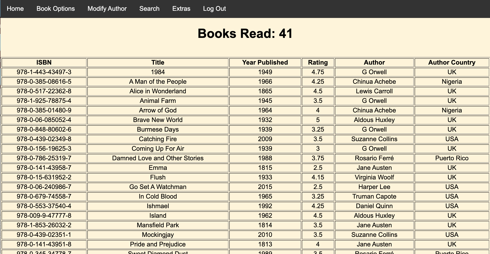
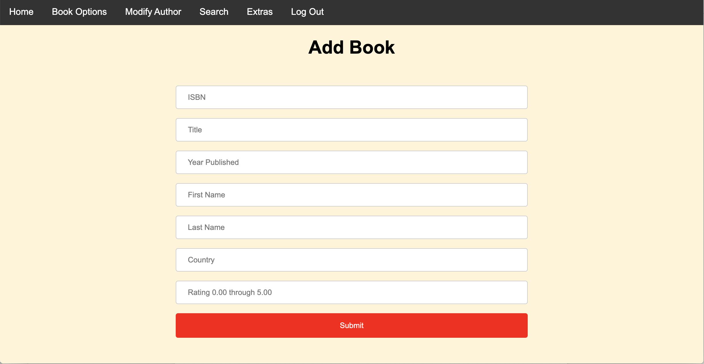
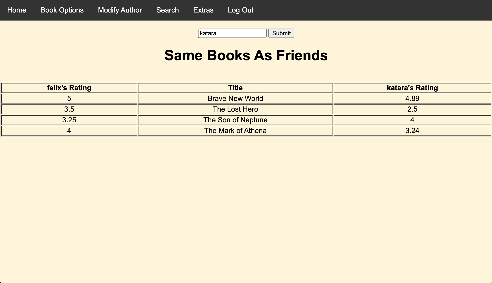
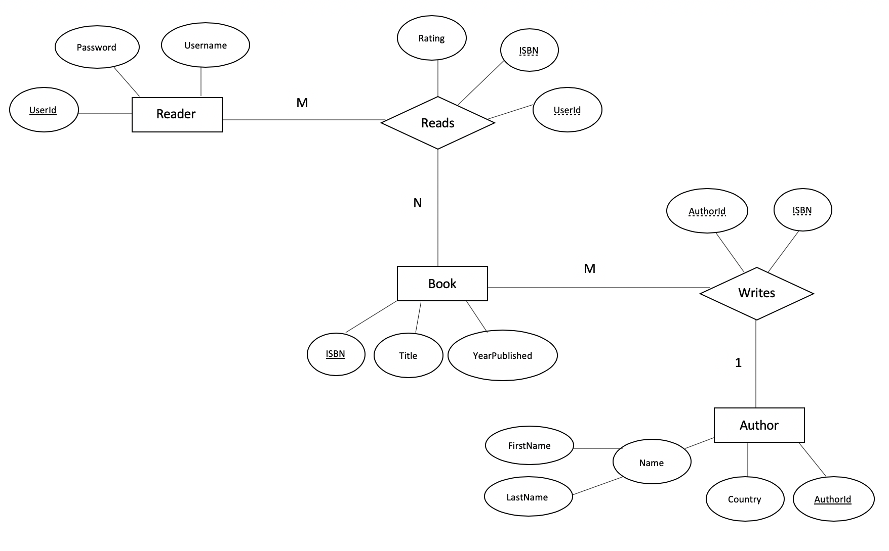

# Ready Set Read Database Project

This is a project to practice using Flask and for learning how to use databases. For this project the choosen database is SQLite.
The purpose of this project is to be able to record the books a user has read and assign them a rating.

## Images

 The home page for the application. 

 The interface for adding a book in the application. 

 The interface for seeing the book users have in common. 

## ER Diagram

## Notice
If going to run the source code the programer will have to put the location of the database in database.py.
